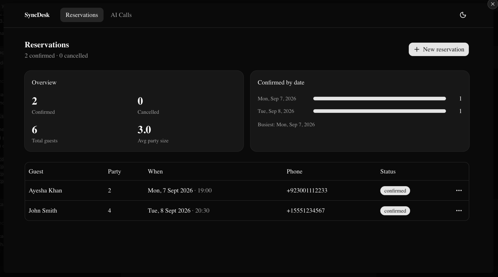
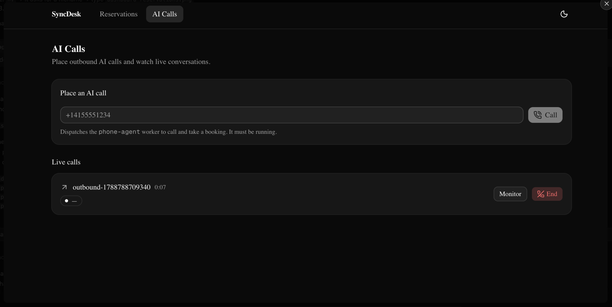
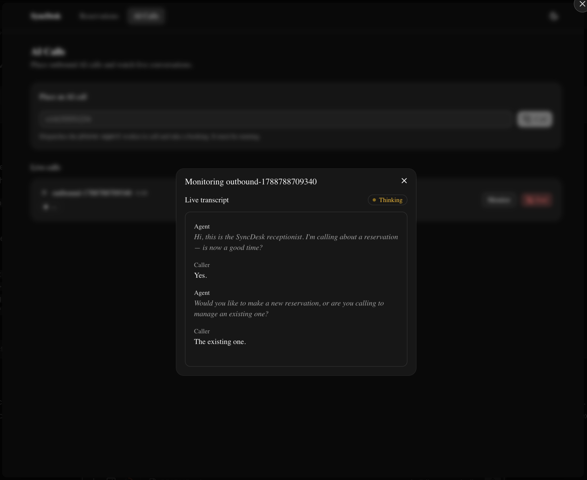

# SyncDesk AI Receptionist

An AI phone receptionist for a restaurant. It answers and places real phone
calls, takes table bookings by voice, and ships with a web dashboard to manage
reservations and watch calls live.

Three services:

- **booking/** — Go REST API + MCP server. Stores reservations, owns the booking rules.
- **phone-agent/** — LiveKit + Telnyx voice agent. The receptionist on the phone.
- **dashboard/** — Next.js + shadcn UI. Manage reservations, place & monitor AI calls.

Voice pipeline: Silero VAD → Deepgram Flux (STT) → Gemma 4 (LLM) → Rime Mist v3
(TTS), all through LiveKit Cloud Inference.

## Prerequisites

- Go 1.22 or later
- Node.js 20 or later
- A LiveKit Cloud account (free tier is fine)
- A Telnyx account with a phone number + SIP connection

## Setup

- cp phone-agent/.env.example phone-agent/.env   *(fill in LiveKit + Telnyx creds)*
- cd phone-agent && npm install && npm run setup:sip
- cd ../dashboard && npm install

## Run

- ./run.sh — starts the booking API, the phone agent, and the dashboard together
- open http://localhost:3000 — the dashboard
- call your Telnyx number — talk to the receptionist
- Ctrl-C — stops everything

## What you can do

- Dial the number and book, change, or cancel a table entirely by voice
- Dashboard → **Reservations** — create / edit / cancel / delete bookings, see stats
- Dashboard → **AI Calls** — place an outbound AI call, watch the live transcript
  and agent state, end a call

## Docs

- [`diagram.md`](diagram.md) — system design and call flows
- [`booking/README.md`](booking/README.md) — API endpoints + MCP tools
- [`phone-agent/README.md`](phone-agent/README.md) — agent setup, SIP trunks, tuning
- [`dashboard/README.md`](dashboard/README.md) — the web app

## Notes

- The booking store is **in memory** and resets on restart — swap
  `booking/internal/storage` for a database when you need persistence.
- No auth anywhere. Local / demo use only.

## Authors

- [@nomankhokhar](https://www.github.com/nomankhokhar)

## Badges

## 🚀 About Me

I'm a full Stack Developer...
