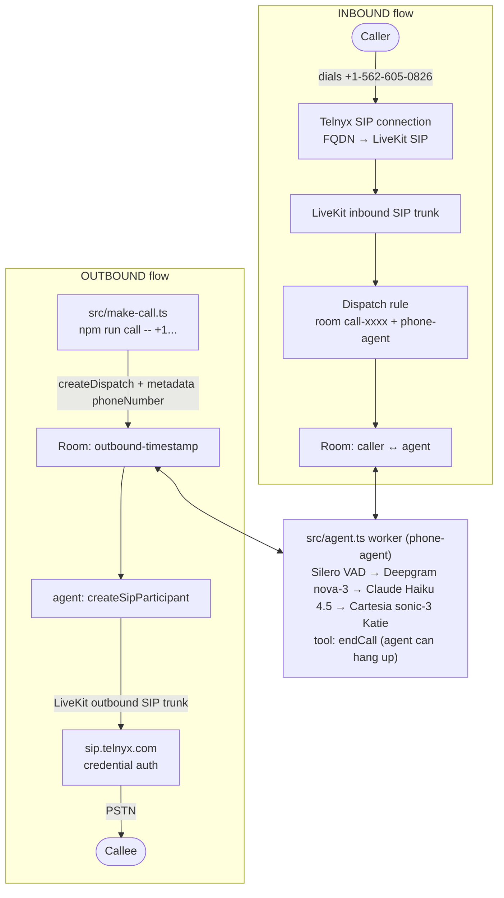

# LiveKit Phone Agent — Architecture & Flow

An AI phone agent built on **LiveKit + Telnyx** — a single voice bot that both **answers** calls to +1‑562‑605‑0826 and **places** outbound calls, speaking with Claude's brain and Cartesia's voice.

## The pieces

| File | Role |
|---|---|
| `src/agent.ts` | The worker. Defines the voice agent, handles both inbound and outbound calls, registered under the name `phone-agent` |
| `src/make-call.ts` | CLI trigger for outbound calls (`npm run call -- +1...`) |
| `inbound-trunk.json` | LiveKit SIP config: accept calls arriving for +15626050826 (Krisp noise cancellation on) |
| `outbound-trunk.json` | LiveKit SIP config: dial out through `sip.telnyx.com` with the Telnyx SIP credentials |
| `dispatch-rule.json` | Tells LiveKit: every incoming call gets its own room (`call-xxxx`) and auto-dispatches the `phone-agent` into it |

## The voice pipeline (per call)

Every call runs the same real-time loop (`src/agent.ts:64-82`):

```
Caller audio → Silero VAD (detects speech) → Deepgram nova-3 (speech→text)
            → Claude Haiku 4.5 (generates reply)
            → Cartesia sonic-3 "Katie" voice (text→speech) → Caller
```

Notes on the pipeline:

- **LLM is Claude** (`claude-haiku-4-5`), reached through Anthropic's OpenAI-compatible endpoint (`baseURL: https://api.anthropic.com/v1/`) because LiveKit has no Node.js Anthropic plugin. Haiku is the fastest/cheapest Claude — right for real-time voice.
- **The agent has one tool, `endCall`** — Claude can hang up on its own after saying goodbye (deletes the room after a 2s grace period for the TTS to finish).
- The greeting turns pass a synthetic user message (e.g. `[Incoming call connected…]`) because Anthropic requires at least one non-system message per request.
- The VAD model is loaded once per process in `prewarm` so new calls connect fast.

## Architecture / flow diagram

```
                            ┌──────────────────────────────────────────────┐
                            │                LiveKit Cloud                 │
                            │                                              │
 INBOUND                    │  ┌───────────┐   ┌───────────────────┐       │
 ┌────────┐   PSTN   ┌──────┴─┐│  Inbound  │   │  Dispatch rule    │       │
 │ Caller │ ───────► │ Telnyx ││  SIP trunk│──►│  room "call-xxxx" │       │
 └────────┘  dials   │  SIP   ││(+1562...) │   │  + agent          │       │
             number  │ connec-│└───────────┘   └────────┬──────────┘       │
                     │  tion  │                         ▼                  │
                     │ (FQDN) │                ┌─────────────────┐         │
                     └──────┬─┘                │      Room       │         │
                            │                  │ caller ↔ agent  │         │
                            │                  └────────▲────────┘         │
                            │                           │ joins            │
                            └───────────────────────────┼──────────────────┘
                                                        │
                                          ┌─────────────┴─────────────┐
                                          │  src/agent.ts worker      │
                                          │  ("phone-agent")          │
                                          │  VAD → Deepgram → Claude  │
                                          │  → Cartesia  (+ endCall)  │
                                          └─────────────▲─────────────┘
                                                        │ dispatch w/ metadata
 OUTBOUND                                               │ { phoneNumber }
 ┌──────────────────┐ createDispatch(room,"phone-agent")│
 │ src/make-call.ts │ ──────────────────────────────────┘
 └──────────────────┘
        then agent calls createSipParticipant(SIP_OUTBOUND_TRUNK_ID, number)
        → LiveKit SIP → sip.telnyx.com (credential auth) → PSTN → Callee joins room
```

### Mermaid version



## The two flows in detail

**Inbound** — Someone dials the Telnyx number. The Telnyx SIP connection (FQDN type, pointed at the LiveKit project SIP URI) forwards the call to LiveKit. The inbound trunk accepts it, the dispatch rule creates a fresh room and dispatches `phone-agent`. The job metadata is empty, so `isOutbound` is false and the agent greets the caller immediately.

**Outbound** — You run `npm run call -- +923100660762`. `src/make-call.ts` creates a dispatch to a new room named `outbound-<timestamp>` with `{ phoneNumber }` as metadata. The same agent wakes up, sees the phone number, and calls `createSipParticipant` — LiveKit dials out through `sip.telnyx.com` using the trunk's SIP credentials. `waitUntilAnswered: true` blocks until pickup, then the agent introduces itself; on busy/no-answer it deletes the room so the worker doesn't hang.

## Key design choices

- **Named agent** (`agentName: 'phone-agent'`): the agent only joins rooms it's explicitly dispatched to — by the dispatch rule (inbound) or by make-call.ts (outbound). The name must match in `src/agent.ts`, `dispatch-rule.json`, and `src/make-call.ts`.
- **Claude via OpenAI-compat layer**: two Anthropic-specific requirements are handled in code — the `tools` list must not be empty (solved by the real `endCall` tool) and every request needs at least one user message (solved by synthetic user input on greeting turns).

## Environment variables (`.env`)

`LIVEKIT_URL`, `LIVEKIT_API_KEY`, `LIVEKIT_API_SECRET`, `SIP_OUTBOUND_TRUNK_ID` (from `lk sip outbound create`), `SIP_FROM_NUMBER`, `ANTHROPIC_API_KEY` (LLM), `DEEPGRAM_API_KEY` (STT), `CARTESIA_API_KEY` (TTS).
