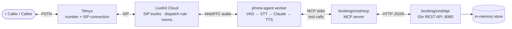
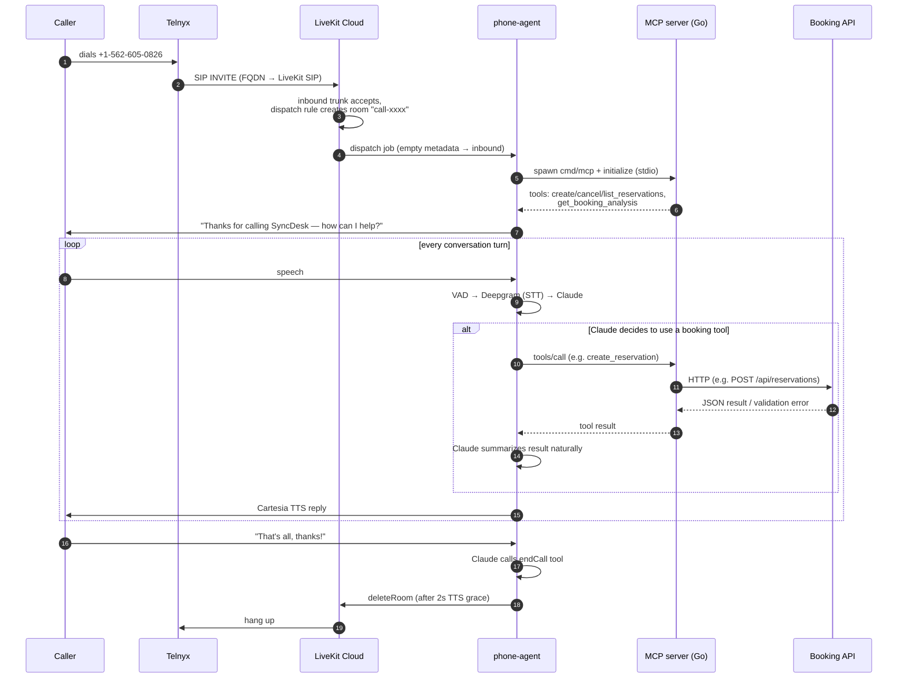
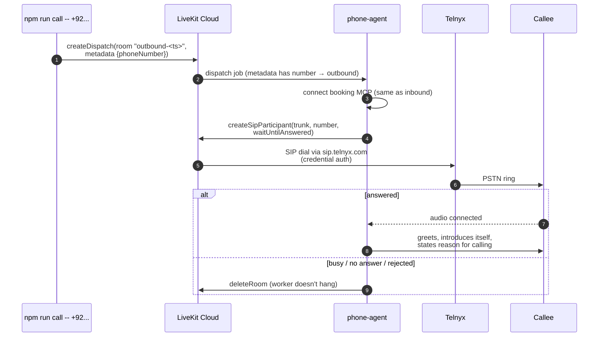
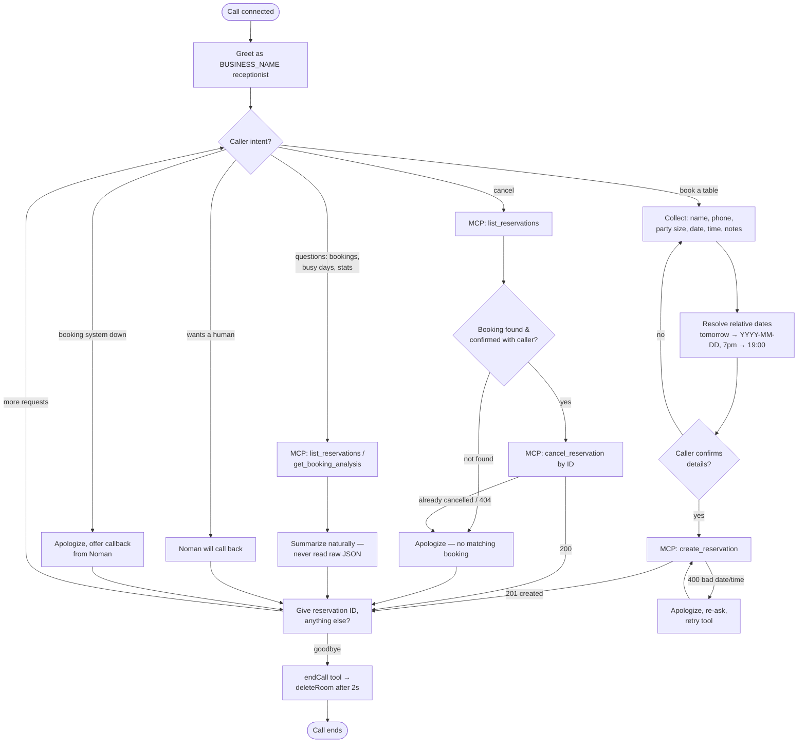
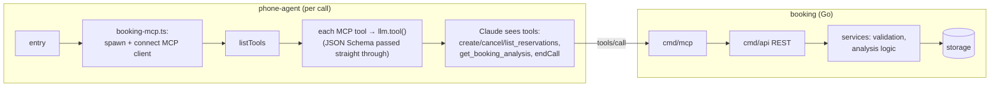

# SyncDesk AI Agent — System Design

An AI **receptionist** built on **LiveKit + Telnyx** that answers and places phone calls on +1‑562‑605‑0826, and manages reservations through a **Go booking service** connected over **MCP**.

## 1. High-level system design

```
                 ┌─────────────────────── TELEPHONY ───────────────────────┐
                 │                                                         │
 ┌────────┐ PSTN │ ┌────────────┐        ┌──────────────────────────┐      │
 │ Caller │◄────►│ │   Telnyx   │◄──SIP──►│      LiveKit Cloud      │      │
 └────────┘      │ │ (number +  │        │  inbound/outbound trunks │      │
                 │ │ SIP trunk) │        │  dispatch rule → rooms   │      │
                 │ └────────────┘        └────────────┬─────────────┘      │
                 └───────────────────────────────────┼─────────────────────┘
                                                     │ WebRTC (audio)
                 ┌─────────────────── AI AGENT ──────▼─────────────────────┐
                 │  phone-agent/  (Node.js worker, name: "phone-agent")    │
                 │                                                         │
                 │  Silero VAD → Deepgram nova-3 (STT)                     │
                 │             → Claude Haiku 4.5 (LLM)                    │
                 │             → Cartesia sonic-3 (TTS)                    │
                 │                                                         │
                 │  Tools: endCall + everything the MCP server publishes   │
                 └────────────────────────┬────────────────────────────────┘
                                          │ MCP (stdio, auto-spawned per call)
                 ┌────────────────────────▼──────────────────────────────────┐
                 │  booking/  (Go)                                           │
                 │  cmd/mcp (MCP server) ──HTTP──► cmd/api (Gin REST :8080)  │
                 │  controllers → services → storage (in-memory)             │
                 └───────────────────────────────────────────────────────────┘
```



## 2. Inbound call — from ring to booked table



## 3. Outbound call



## 4. Receptionist decision flow — all conversation paths



## 5. MCP tool bridge — how tools reach the receptionist



Add a tool in `booking/cmd/mcp/main.go` → it appears to the receptionist automatically. If the MCP server can't start (booking API down), the agent still answers and apologizes.

## 6. Key design decisions

| Decision | Why |
|---|---|
| Named agent (`phone-agent`) | Explicit dispatch only — joins rooms via dispatch rule (inbound) or make-call.ts (outbound). Name must match in `agent.ts`, `dispatch-rule.json`, `make-call.ts` |
| Claude via OpenAI-compat endpoint | LiveKit has no Node.js Anthropic plugin; requires ≥1 user message (synthetic greeting input) and a non-empty tool list (endCall) |
| Static TTS greeting (`session.say`) | Skips an LLM round-trip on call pickup — caller hears the greeting in ~1 s instead of ~15 s. (LiveKit Inference stack — Gemini Flash-Lite + Rime — was benchmarked and reverted: ~400 ms/turn slower from a non-US worker.) |
| MCP between agent and booking | Tools are discovered at call time, not hardcoded — Go and Node.js sides evolve independently |
| MCP server as thin HTTP client | One source of truth (REST API); same tools usable from Claude Desktop / Claude Code directly |
| Validation in Go service layer | Bad dates/times return errors the LLM can read, apologize for, and retry |
| In-memory store behind `storage.Store` | Demo-simple; swap for a DB by reimplementing four methods |
| Config env-only, JSONs are templates | No credentials in git — `setup-sip.ts` renders `${VAR}` placeholders from `.env` |
